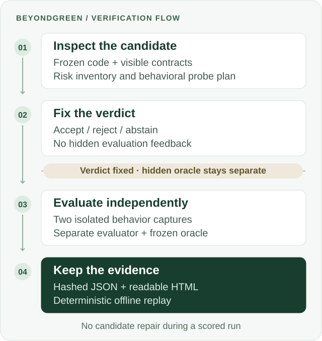

<h1 align="center">BeyondGreen</h1>

<p align="center">
  <strong>Your tests are green. Is your migration correct?</strong>
</p>

<p align="center">
  AI verification for React state-to-signals migrations.<br>
  Find the behavior your inherited tests leave unchecked — and keep the evidence.
</p>

<p align="center">
  <a href="https://youtu.be/R_AA3WqmVyw"><strong>Watch the demo · 4:54</strong></a> ·
  <a href="https://www.hackerearth.com/community/challenges/hackathon/micro1-frontier-engineering-challenge-2026/">Hackathon</a> ·
  <a href="#quick-start">Quick start</a> ·
  <a href="#results">Results</a> ·
  <a href="docs/README_RU.md">Русский</a>
</p>

<p align="center">
  <a href="docs/assets/micro1-participation.png">
    
  </a>
  <br>
  <sub>Participant · <a href="https://www.hackerearth.com/community/challenges/hackathon/micro1-frontier-engineering-challenge-2026/">micro1 Frontier Engineering Challenge 2026</a></sub>
</p>

<p align="center">
  <strong>19/20 correct decisions</strong> vs. <strong>10/20</strong> from compilation and legacy tests.<br>
  <sub>Recorded on 20 frozen synthetic candidates · <a href="docs/EVALUATION.md">Methodology, evidence, and limits</a></sub>
</p>

---

## Why BeyondGreen

You migrate a React component to signals. It compiles. Every inherited test passes.
Then a delayed response overwrites fresh state, a subscription survives unmount, or a
rollback restores the wrong value.

**The test suite stayed green because it never checked that behavior.**

BeyondGreen is a verification prototype for frontend engineers facing that merge
decision. It inspects an existing candidate, identifies migration risks, and derives
additional behavioral checks. Its decision is fixed before an independent evaluator
can reveal hidden expectations.

You get a verdict you can inspect, evidence you can replay, and an explicit abstention
when the system cannot support a decision.

## What you get

| Output | Why it matters |
| --- | --- |
| **Accept / reject / abstain** | Distinguish a supported decision from an inconclusive run. An abstention blocks merge. |
| **Migration risk inventory and probe plan** | Inspect which assumptions about updates, identity, subscriptions, and lifecycle were investigated. |
| **Validated JSON and readable HTML** | Follow the decision back to its recorded evidence. |
| **Deterministic offline replay** | Verify the published result without another model call or credentials. |

**Current scope:** React state-to-signals migrations on independently authored synthetic
fixtures. Generalization to production repositories has not been demonstrated.

## Results

**All 20 candidates compiled and passed every visible legacy test. Only 10 preserved
the intended behavior.**

The experiment covers ten behavior classes, with one correct migration and one version
containing a single seeded defect per scenario. Both methods receive identical frozen
candidate code, visible inputs, the same environment, and one attempt per candidate.

| Metric | Compilation + legacy tests | BeyondGreen | Predeclared target |
| --- | ---: | ---: | --- |
| Correct decisions | 10/20 | **19/20** | ≥16/20 — met |
| Additional correct decisions | — | **+9/20** | ≥6/20 — met |
| Defects credited with a correct reason | 0/10 | **3/10** | ≥8/10 — **missed** |
| Correct migrations blocked | 0/10 | **1/10** | ≤2/10 — met |
| Completed decisions | 20/20 | **19/20** | ≥18/20 — met |

The single blocked correct migration received an **abstention**, not a proven-defect
verdict. The reason score uses a strict wording match: seven correct rejections missed
the required token or action label. The published **3/10 remains unchanged**.

The baseline makes no model calls; BeyondGreen uses one per candidate. This measures
decision quality, not equal compute cost or a demonstrated saving in review time.

<details>
<summary>What the benchmark measures — and what it does not</summary>

- Targets, candidate code, and scoring were frozen before the official evaluation.
- The reason scorer requires the normalized rationale to literally contain the
  evaluator's behavior-class token or failed-action label. It is a lexical proxy,
  not a semantic assessment of every explanation.
- The predeclared challenging case, `BG-H02` (async ordering), exposes this distinction:
  BeyondGreen rejected the defective migration and described the stale completion,
  but its wording did not satisfy the frozen matcher.
- `BG-H06` accounts for the one preserving-case abstention. It counts as blocked,
  incomplete, and incorrect under the predeclared rules.
- This is one fixed synthetic evaluation, `eval-v1.1.0`; it does not establish
  production accuracy or general-purpose repository verification.

</details>

[Full evaluation](docs/EVALUATION.md) · [Claims and evidence](artifacts/claims.yaml) ·
[Recorded aggregate](artifacts/evaluation/official/RUN-BG-OFFICIAL-EVAL-V1.1.0-002-POSTDECISION-004/aggregate.json)

## How it works



1. **Inspect the unchanged candidate.** Inventory risks and derive a probe plan from
   visible code and contracts.
2. **Commit a verdict.** Fix the accept, reject, or abstain decision before hidden
   evaluation expectations become available. The candidate is never repaired during
   a scored run.
3. **Evaluate independently.** After the decisions are final, isolated observers capture
   behavior twice and a separate evaluator checks the evidence against the frozen oracle.
4. **Make the result checkable.** Bind the decision, observations, and report with hashes;
   reproduce the JSON and HTML through offline replay.

<details>
<summary>The trust boundaries behind the verdict</summary>

- **Physical isolation.** Decision-making processes cannot enumerate, read, hash, or
  error-probe the verifier-only package. The evaluator cannot read candidate source.
  Tests assert both directions of denial.
- **No hidden feedback (`K=0`).** Evaluation findings cannot reach either method before
  its verdict is final. No feedback or repair rounds influence the scored decision.
- **Immutable inputs.** Candidate hashes are checked before and after execution.
- **Fail-closed evidence.** Duplicate captures must match. Hash drift, invalid schemas,
  and inconsistent observations stop verification instead of producing a success claim.
- **Replayable reports.** Canonical JSON, recorded hash chains, and deterministic replay
  make tampering detectable.

[Architecture](docs/ARCHITECTURE.md) · [Product specification](docs/PROJECT_SPEC.md)

</details>

## Quick start

Use **Node.js 22.22.3**, as pinned in [`.node-version`](.node-version), and `make`.
Start by verifying the recorded result:

```bash
git clone https://github.com/BolshakovAndrey/micro1-beyondgreen.git
cd micro1-beyondgreen
make setup
make eval
```

`make setup` installs locked dependencies. After installation, `make eval` runs offline
and prints **`OFFICIAL_OFFLINE_REPLAY_VERIFIED`**. It verifies the stored evidence;
it does not rerun the model or create another scored evaluation.

**No API key, login, or model call is needed for offline replay.**

### Explore the local demo

On **macOS**, generate the unscored D01 demonstration:

```bash
make demo
```

Open `artifacts/evaluation/BG-D01-VERTICAL-SLICE.html` to inspect the report an engineer
receives. Prefer a walkthrough? [Watch the 4:54 demo on YouTube](https://youtu.be/R_AA3WqmVyw)
or use the [Vimeo mirror](https://vimeo.com/1222716472).

<details>
<summary>Verification commands and platform requirements</summary>

| Command | What it does |
| --- | --- |
| `npm run task -- list` | List every supported task and its purpose. |
| `make baseline` | Validate the frozen baseline command contract; no scored execution. |
| `make solution` | Validate the frozen BeyondGreen command contract; no scored execution. |
| `npm test` | Run the full ordinary suite, including macOS isolation checks. |
| `npm run task -- d01:replay` | Replay the unscored D01 evidence offline. |
| `make artifacts-check` | Check compilation, checksums, official replay, and submission metadata. |

Offline replay is cross-platform. Live isolation and the full local verification suite
require macOS `/usr/bin/sandbox-exec` plus Node's permission model. Unsupported platforms
fail closed; there is no weaker fallback.

The official scored run is immutable and create-once. Verify it with `make eval`;
the reproduction guide preserves its original execution commands for provenance.

</details>

[Complete reproduction guide](docs/REPRODUCTION.md) · [D01 demo details](docs/D01_REPRODUCTION.md)

## Built with

**TypeScript · Node.js · React · Preact Signals · jsdom · Zod · node:test**

The official evaluation used `gpt-5.6-sol` through `codex-exec-jsonl-v1`, one invocation
per BeyondGreen candidate and zero retries. Fixed-subscription marginal cost and stable
token totals were not measured. Exact versions, agent roles, and provenance are recorded
in [Disclosures](docs/DISCLOSURES.md) and [Third-party notices](THIRD_PARTY_NOTICES.md).

## What building it taught me

**A process boundary needs tests as much as the code it protects.**

The preserved failed official attempts broke in launch, observation, and evaluation
bridges. Isolating the oracle made decisions checkable, while moving correctness risks
into the messages crossing that boundary.

The strongest retained change was a shared execution pipeline driven by fixture
descriptions and explicit permissions. It supported ten different scenarios while
preserving isolation. The broader generation-and-repair scope was removed so the
experiment could focus on one measurable question: **should this migration be accepted?**

[Improvement Changelog](docs/IMPROVEMENT_CHANGELOG.md) records the changes, failed attempts,
and evidence behind these decisions; see ITR-043 onward for the boundary failures.

## Go deeper

| Read | For |
| --- | --- |
| [Reviewer guide](docs/REVIEWER_GUIDE.md) | What to inspect and what each command proves. |
| [Submission report](docs/SUBMISSION_REPORT.md) | The original engineering summary and measured comparison. |
| [Architecture](docs/ARCHITECTURE.md) | Components, process boundaries, and data flow. |
| [Product specification](docs/PROJECT_SPEC.md) | The normative behavior contract. |
| [Evaluation](docs/EVALUATION.md) | Frozen methodology, targets, results, and limitations. |
| [Reproduction](docs/REPRODUCTION.md) | Setup, expected output, runtime, and cost accounting. |
| [Agent trajectories](artifacts/trajectories/index.yaml) | Reviewed instructions, tool responses, retries, and human checkpoints. |
| [Disclosures](docs/DISCLOSURES.md) | Scope, provenance, tools, and limitations. |

[Clean-room policy](docs/CLEAN_ROOM_POLICY.md) · [Trace policy](docs/TRACE_POLICY.md) ·
[Provenance](docs/PROVENANCE.md) · [Presentation assets](docs/assets/README.md)

---

**Green tests are a starting point. A merge decision needs evidence.**
