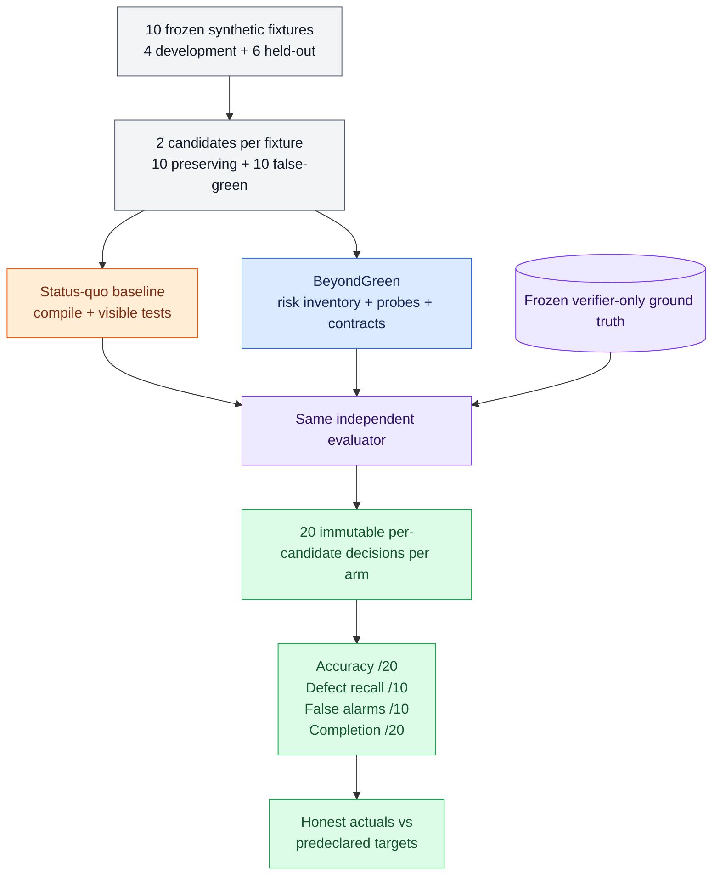
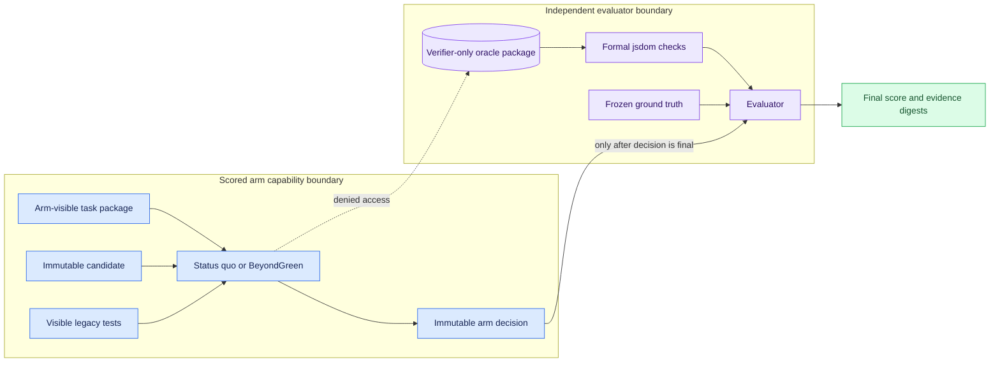
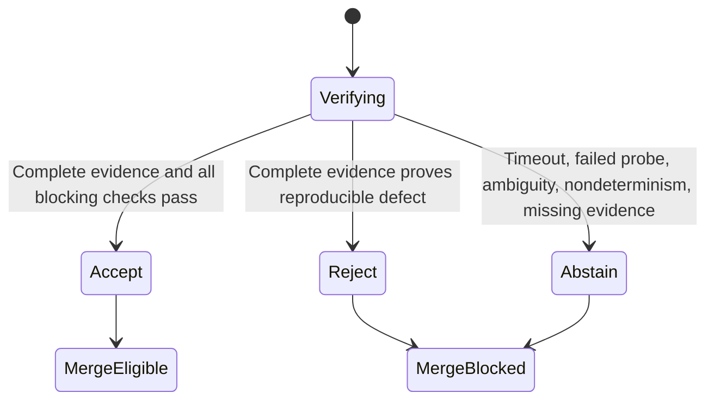
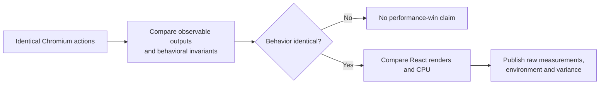

# BeyondGreen — Mermaid-диаграммы verify-existing workflow

**Статус:** ненормативная русская проекция для review и будущего видео
**Нормативный источник:** `docs/PROJECT_SPEC.md@1.1.0`
**Submission status:** фактическая архитектура подтверждена реализацией и тестами;
диаграммы остаются вспомогательной русской проекцией, а не нормативным источником

## 1. Единственный scored workflow

```mermaid
flowchart LR
    CAND["Existing immutable<br/>state-to-signals candidate"] --> H["Hash and freeze identity"]
    H --> I["Inventory migration risks"]
    I --> L["Compile and run visible<br/>legacy tests"]
    L --> P["Derive risk-linked probes<br/>and contracts"]
    P --> V["Oracle-free internal<br/>jsdom checks"]
    V --> D{"Arm evidence complete?"}
    D -- "No / timeout / probe failure" --> S["ABSTAIN<br/>block merge"]
    D -- "Yes, defect proved" --> R["REJECT"]
    D -- "Yes, all blocking checks pass" --> A["ACCEPT"]
    S --> J["Schema-valid JSON"]
    R --> J
    A --> J
    J --> T["Static HTML report"]
    T --> F["Freeze arm verdict"]
    F --> EVAL["Independent evaluator"]
    O[("Verifier-only oracle")] --> EVAL
    EVAL --> Q["Post-decision score<br/>and evidence digests"]

    classDef input fill:#f3f4f6,stroke:#4b5563,color:#111827;
    classDef bg fill:#dbeafe,stroke:#2563eb,color:#172554;
    classDef verifier fill:#ede9fe,stroke:#7c3aed,color:#2e1065;
    classDef accepted fill:#dcfce7,stroke:#16a34a,color:#14532d;
    classDef rejected fill:#fee2e2,stroke:#dc2626,color:#7f1d1d;
    classDef abstain fill:#fff4cc,stroke:#a66b00,color:#713f12;

    class CAND,H input;
    class I,L,P,V,J,T,F bg;
    class O,EVAL,Q verifier;
    class D verifier;
    class A accepted;
    class R rejected;
    class S abstain;
```

Главная мысль: BeyondGreen не пишет candidate и не видит oracle во время scored run.
Его internal checker использует только arm-visible probes/contracts и выдаёт
evidence-backed `accept`, `reject` или fail-closed `abstain`. Только после фиксации
этого verdict independent evaluator использует verifier-only oracle для scoring.

## 2. Честное сравнение на одинаковых candidates

Главная мысль: здесь два scored arms, а не три. Они получают одни и те же 20
immutable candidates. Baseline принимает при зелёной compilation/visible tests;
BeyondGreen должен доказательно отличить preserving candidates от seeded false
greens.

## 3. Физическая изоляция oracle и K=0

Главная мысль: скрытый oracle отсутствует в process/filesystem mounts обоих arms.
Denied-access test доказывает это до scoring. `K=0` означает, что никакая verifier
diagnostic не возвращается arm до final decision.

## 4. Fail-closed decision semantics

`abstain` безопасно блокирует merge, но не считается правильным accept/reject
decision, defect recall или completion. На preserving candidate он считается false
alarm.

## 5. Вторичный performance protocol

Главная мысль: performance сравнивается только после доказанной behavioral
equivalence и никогда не влияет на 20 scored decisions.

## 6. Пройденный critical path

```mermaid
flowchart LR
    S["Approved normative v1.1 ✓"] --> T["Eligible trace-first gate ✓"]
    T --> D1["Complete BG-D01 vertical slice ✓"]
    D1 --> Z["Early ZIP clean-extraction dry run ✓"]
    Z --> D10["BG-D02–BG-D04 and<br/>BG-H01–BG-H06 ✓"]
    D10 --> U["Single held-out unblinding ✓"]
    U --> EVID["Official evidence + offline replay ✓"]
    EVID --> VIDEO["Public video URLs verified ✓"]
    VIDEO --> F["Final review + ZIP"]
```

## 7. Gate переноса в judge-facing материалы

Перед окончательным переносом диаграмм в submission или видео необходимо:

- [x] получить final human approval нормативной v1.1;
- [x] связать фактические компоненты с `FR-001`–`FR-012`, `EV-001`–`EV-013` и
  `NFR-001`–`NFR-009`;
- [x] подтвердить process/filesystem boundaries и denied-access tests;
- [x] заменить плановые подписи фактическими component и artifact names;
- [x] привязать результаты к immutable evidence и run IDs;
- [ ] пройти финальный общий privacy, provenance и accuracy review уже собранного ZIP.
