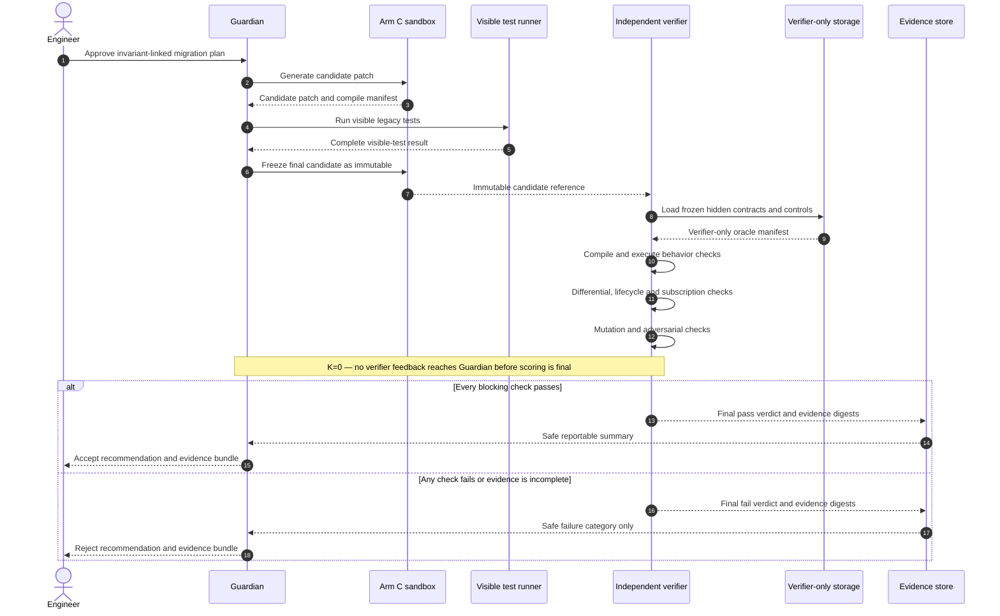
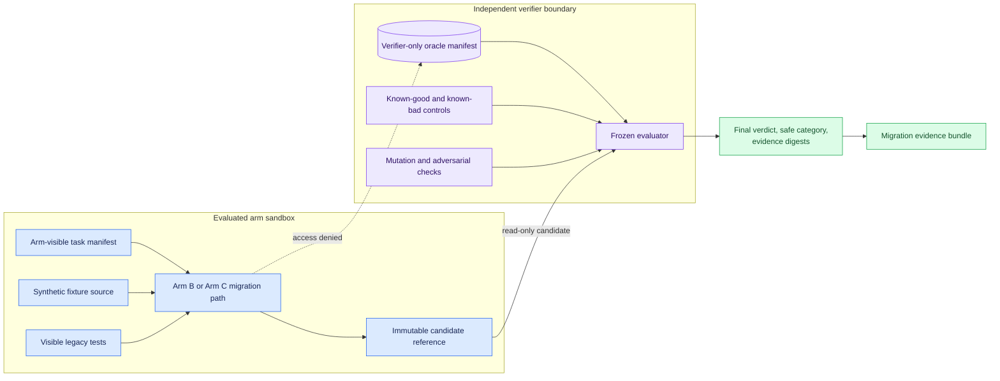
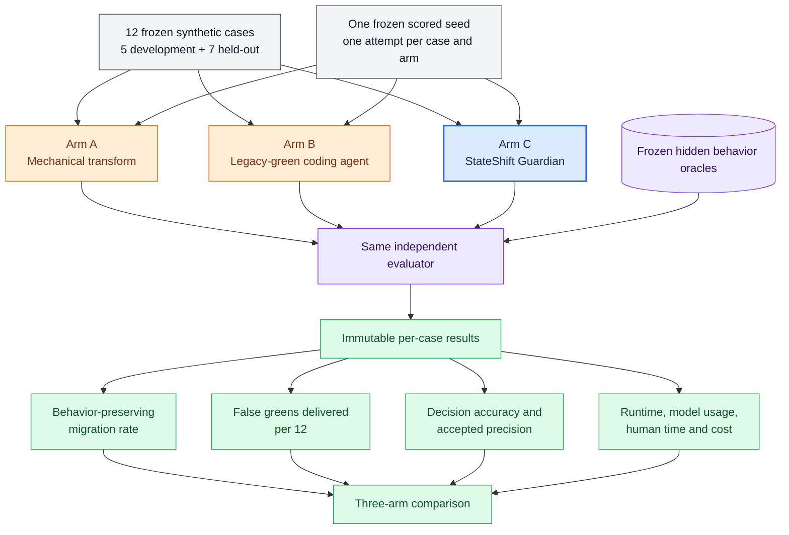

# StateShift Guardian — Mermaid-диаграммы процесса

**Статус:** локальный ненормативный draft для обсуждения и будущего видео
**Нормативный источник:** `docs/PROJECT_SPEC.md`
**Submission status:** исключён до независимого переноса и review в чистой задаче

Диаграммы используют английские подписи внутри блоков, чтобы их можно было позже
перенести в англоязычную видео-презентацию. Русский текст под схемами объясняет, что
именно должен понять зритель.

## 1. Как StateShift Guardian работает целиком

```mermaid
flowchart LR
    U["Frontend engineer"] --> S["Select synthetic migration case"]
    S --> I["Inventory state, reads, writes,<br/>effects and subscriptions"]
    I --> C["Derive visible migration contract"]
    C --> P["Create invariant-linked plan"]
    P --> H1{"Human approves plan?"}
    H1 -- "No" --> R1["Reject safely"]
    H1 -- "Yes" --> X["Generate patch in isolated sandbox"]
    X --> T["Run visible legacy tests"]
    T --> F["Freeze immutable final candidate"]
    F --> V["Independent verification gate"]
    O[("Frozen verifier-only oracle")] --> V
    V --> D{"Preserving and complete?"}
    D -- "No" --> R2["Reject with evidence"]
    D -- "Yes" --> A["Accept with evidence"]
    R1 --> B["Migration evidence bundle"]
    R2 --> B
    A --> B
    B --> H2{"Human approves external application?"}
    H2 -- "No" --> STOP["Keep sandboxed result only"]
    H2 -- "Yes" --> OUT["Patch is eligible for external use"]

    classDef human fill:#fff4cc,stroke:#a66b00,color:#1f2937,stroke-width:2px;
    classDef guardian fill:#dbeafe,stroke:#2563eb,color:#172554,stroke-width:2px;
    classDef verifier fill:#ede9fe,stroke:#7c3aed,color:#2e1065,stroke-width:2px;
    classDef accepted fill:#dcfce7,stroke:#16a34a,color:#14532d,stroke-width:2px;
    classDef rejected fill:#fee2e2,stroke:#dc2626,color:#7f1d1d,stroke-width:2px;

    class U,H1,H2 human;
    class S,I,C,P,X,T,F,B guardian;
    class O,V,D verifier;
    class A,OUT accepted;
    class R1,R2,STOP rejected;
```

Главная мысль для видео: Guardian не является «ещё одним агентом, который пишет
патч». Его продукт — проверяемое решение принять или отклонить миграцию вместе с
полным пакетом доказательств. Человеческое одобрение присутствует до изменения и до
внешнего применения.

## 2. Что происходит внутри независимой верификации

Главная мысль для видео: сначала фиксируется неизменяемый кандидат, и только после
этого верификатор получает его для оценки. Guardian не видит скрытые expected values,
diffs и диагностику до финализации score, поэтому не может подстроить патч под оракул.

## 3. Почему скрытый оракул действительно скрыт

Главная мысль для видео: это не секретный текст в промпте и не просьба агенту «не
подглядывать». Процессы и filesystem mounts разделены. В evaluated sandbox физически
нет verifier-only paths, а denied-access tests проверяют Arms B и C.

## 4. Как доказывается улучшение относительно baseline

Главная мысль для видео: три подхода получают одинаковые кейсы, один и тот же seed и
один независимый evaluator. Улучшение измеряется не количеством написанного кода, а
долей действительно сохраняющих поведение миграций и снижением числа доставленных
false-green-патчей.

## 5. Как использовать диаграммы в видео до пяти минут

1. **Диаграмма 1, 15–20 секунд:** после формулировки проблемы показать полный путь
   от выбора компонента до доказательного accept/reject.
2. **Диаграмма 3, 10–15 секунд:** объяснить основную инженерную защиту — физическую
   изоляцию скрытого оракула.
3. **Живой demo run, 90–120 секунд:** показать baseline false green и Guardian verdict.
4. **Диаграмма 2, 15–20 секунд:** поверх сокращённой trajectory пояснить момент
   immutable candidate и K=0.
5. **Диаграмма 4, 15–20 секунд:** перейти от одного demo case к итоговой таблице
   трёх плеч.

В финальном видео диаграммы должны сопровождать настоящий сохранённый run, а не
заменять его. Числовые результаты добавляются только после финальной evaluation и
должны ссылаться на неизменяемые evidence/run IDs.

## 6. Gate переноса в judge-facing материалы

До переноса этих диаграмм в `docs/ARCHITECTURE.md` или видео необходимо:

- одобрить нормативную глобальную спецификацию и открытые решения;
- независимо пересоздать Mermaid source в submission-eligible clean task;
- связать блоки с requirement IDs `FR-001`–`FR-012`, `EV-001`–`EV-012` и
  `NFR-002`–`NFR-006`;
- проверить, что схема совпадает с реализованными процессами и filesystem boundary;
- заменить все планируемые части фактическими названиями компонентов;
- не добавлять результаты, которых ещё нет в evidence;
- выполнить human privacy/provenance review.
