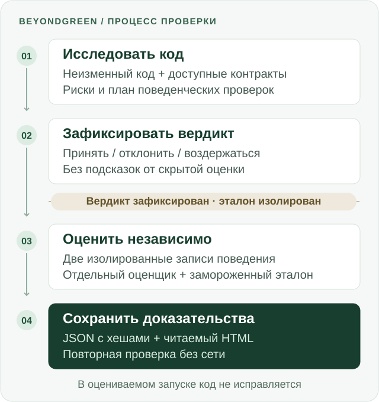

<h1 align="center">BeyondGreen</h1>

<p align="center">
  <strong>Тесты зелёные. А поведение сохранилось?</strong>
</p>

<p align="center">
  AI-проверка миграций состояния React на сигналы.<br>
  Найдите поведение, которое старые тесты не проверяют, — и сохраните доказательства.
</p>

<p align="center">
  <a href="https://youtu.be/R_AA3WqmVyw"><strong>Смотреть демо · 4:54</strong></a> ·
  <a href="https://www.hackerearth.com/community/challenges/hackathon/micro1-frontier-engineering-challenge-2026/">Хакатон</a> ·
  <a href="#быстрый-старт">Быстрый старт</a> ·
  <a href="#результаты">Результаты</a> ·
  <a href="../README.md">English</a>
</p>

<p align="center">
  <a href="assets/micro1-participation.png">
    
  </a>
  <br>
  <sub>Участник · <a href="https://www.hackerearth.com/community/challenges/hackathon/micro1-frontier-engineering-challenge-2026/">micro1 Frontier Engineering Challenge 2026</a></sub>
</p>

<p align="center">
  <strong>19 верных решений из 20</strong> против <strong>10 из 20</strong> у компиляции и старых тестов.<br>
  <sub>Зафиксированный результат на 20 синтетических версиях кода · <a href="EVALUATION.md">Методика, доказательства и ограничения</a></sub>
</p>

---

## Зачем нужен BeyondGreen

Вы переводите React-компонент на сигналы. Код компилируется. Все старые тесты проходят.
Но запоздавший ответ перезаписывает новое состояние, подписка остаётся после удаления
компонента, а откат восстанавливает неверное значение.

**Тесты остались зелёными, потому что не проверяли это поведение.**

BeyondGreen — прототип системы проверки для разработчиков, которым нужно принять
решение о слиянии такой миграции. Он исследует существующую версию кода, выявляет риски
и составляет дополнительные поведенческие проверки. Решение фиксируется до того, как
независимый оценщик сможет раскрыть скрытые эталонные ожидания.

Вы получаете проверяемый вердикт, воспроизводимые доказательства и явный отказ от
решения, когда системе не хватает оснований для вывода.

## Что вы получаете

| Результат | Зачем он нужен |
| --- | --- |
| **Принять / отклонить / воздержаться** | Отличить обоснованное решение от неопределённого результата. Воздержание блокирует слияние. |
| **Перечень рисков и план проверок** | Увидеть, какие предположения об обновлениях, стабильности объектов, подписках и жизненном цикле исследованы. |
| **Проверенный JSON и читаемый HTML** | Проследить связь решения с записанными доказательствами. |
| **Детерминированное воспроизведение без сети** | Проверить опубликованный результат без нового обращения к модели и без учётных данных. |

**Текущие границы:** миграции состояния React на сигналы на независимо созданных
синтетических сценариях. Применимость к промышленным репозиториям ещё не доказана.

## Результаты

**Все 20 версий кода компилировались и проходили все доступные старые тесты.
Только 10 сохраняли нужное поведение.**

Эксперимент охватывает десять классов поведения. Для каждого сценария подготовлены
корректная миграция и версия с одной заложенной ошибкой. Оба метода получают одинаковый
зафиксированный код, доступные входные данные, одинаковое окружение и одну попытку
на каждую версию.

| Метрика | Компиляция + старые тесты | BeyondGreen | Заранее заданная цель |
| --- | ---: | ---: | --- |
| Верные решения | 10/20 | **19/20** | ≥16/20 — достигнута |
| Дополнительные верные решения | — | **+9/20** | ≥6/20 — достигнута |
| Дефекты с засчитанной верной причиной | 0/10 | **3/10** | ≥8/10 — **не достигнута** |
| Заблокированные корректные миграции | 0/10 | **1/10** | ≤2/10 — достигнута |
| Завершённые решения | 20/20 | **19/20** | ≥18/20 — достигнута |

Единственная заблокированная корректная миграция получила **воздержание**, а не вердикт
о доказанном дефекте. Проверка причины использует строгое сопоставление слов:
семь верных отклонений не содержали требуемую метку или название действия.
Опубликованный результат **3/10 сохранён без изменений**.

Базовый метод не обращается к модели; BeyondGreen делает один вызов на версию кода.
Сравнение измеряет качество решений, а не равенство вычислительных затрат или
доказанную экономию времени проверки.

<details>
<summary>Что измеряет эксперимент и чего он не доказывает</summary>

- Цели, проверяемый код и правила оценки зафиксированы до официального эксперимента.
- Чтобы причина была засчитана, нормализованное обоснование должно буквально
  содержать метку класса поведения или неуспешного действия из эталонной проверки.
  Это лексический показатель, а не смысловая оценка каждого объяснения.
- Заранее выбранный сложный случай `BG-H02` — асинхронный порядок обновлений —
  показывает различие: BeyondGreen отклонил дефектную миграцию и описал запоздалое
  завершение, но формулировка не удовлетворила зафиксированному сопоставителю.
- На `BG-H06` пришлось единственное воздержание для корректной миграции. По заранее
  заданным правилам оно считается блокировкой, незавершённостью и неверным решением.
- Это один зафиксированный синтетический эксперимент `eval-v1.1.0`. Он не доказывает
  точность на промышленном коде или пригодность для любых репозиториев.

</details>

[Полная методика](EVALUATION.md) · [Утверждения и доказательства](../artifacts/claims.yaml) ·
[Зафиксированные итоги](../artifacts/evaluation/official/RUN-BG-OFFICIAL-EVAL-V1.1.0-002-POSTDECISION-004/aggregate.json)

## Как это работает



1. **Исследовать неизменный код.** Выявить риски и составить план проверок по
   доступному коду и контрактам.
2. **Зафиксировать вердикт.** Принять, отклонить или воздержаться до раскрытия скрытых
   эталонных ожиданий. В оцениваемом запуске проверяемый код не исправляется.
3. **Оценить независимо.** После окончательной фиксации решений изолированные процессы
   дважды записывают поведение. Отдельный оценщик сверяет доказательства с замороженным
   эталоном.
4. **Сделать результат проверяемым.** Связать решение, наблюдения и отчёт контрольными
   суммами; воспроизвести JSON и HTML без сети.

<details>
<summary>Как защищена независимость проверки</summary>

- **Физическая изоляция.** Процессы, принимающие решения, не могут просматривать,
  читать, хешировать или исследовать через ошибки закрытый пакет проверки.
  Оценщик не может читать исходники кандидата. Оба направления запрета проверяются тестами.
- **Ноль скрытых подсказок (`K=0`).** Выводы оценщика недоступны обоим методам до
  окончательного вердикта. Обратная связь и циклы исправления не влияют на оцениваемое решение.
- **Неизменные входные данные.** Контрольные суммы кода сверяются до и после запуска.
- **Остановка при недостоверных данных.** Повторные наблюдения должны совпасть.
  Изменение контрольных сумм, неверные схемы и противоречивые наблюдения останавливают
  проверку, а не превращаются в успешный результат.
- **Воспроизводимые отчёты.** Канонический JSON, цепочки контрольных сумм и
  детерминированное воспроизведение позволяют обнаружить подмену.

[Архитектура](ARCHITECTURE.md) · [Спецификация продукта](PROJECT_SPEC.md)

</details>

## Быстрый старт

Используйте **Node.js 22.22.3**, закреплённый в [`.node-version`](../.node-version), и `make`.
Начните с проверки сохранённого результата:

```bash
git clone https://github.com/BolshakovAndrey/micro1-beyondgreen.git
cd micro1-beyondgreen
make setup
make eval
```

`make setup` устанавливает зафиксированные зависимости. После установки `make eval`
работает без сети и выводит **`OFFICIAL_OFFLINE_REPLAY_VERIFIED`**. Команда проверяет
сохранённые доказательства; она не запускает модель повторно и не создаёт новый
оцениваемый эксперимент.

**Для воспроизведения без сети не нужны API-ключ, вход в аккаунт или обращение к модели.**

### Посмотреть локальную демонстрацию

На **macOS** создайте демонстрацию D01, которая не входит в оцениваемый эксперимент:

```bash
make demo
```

Откройте `artifacts/evaluation/BG-D01-VERTICAL-SLICE.html`, чтобы посмотреть отчёт,
который получает инженер. Для знакомства с полным процессом есть
[демо на YouTube длительностью 4:54](https://youtu.be/R_AA3WqmVyw) и
[резервная копия на Vimeo](https://vimeo.com/1222716472).

<details>
<summary>Команды проверки и требования к платформе</summary>

| Команда | Что она делает |
| --- | --- |
| `npm run task -- list` | Показывает все поддерживаемые задачи и их назначение. |
| `make baseline` | Проверяет зафиксированный контракт базового метода, без оцениваемого запуска. |
| `make solution` | Проверяет зафиксированный контракт BeyondGreen, без оцениваемого запуска. |
| `npm test` | Запускает весь обычный набор тестов, включая проверки изоляции macOS. |
| `npm run task -- d01:replay` | Воспроизводит доказательства демонстрации D01 без сети. |
| `make artifacts-check` | Проверяет компиляцию, контрольные суммы, официальный повтор и метаданные комплекта. |

Воспроизведение без сети работает на разных платформах. Изолированный запуск и полный
набор локальных проверок требуют macOS `/usr/bin/sandbox-exec` и модели разрешений
Node. На неподдерживаемой платформе проверка прекращается; более слабой замены нет.

Официальный оцениваемый запуск неизменяем и создаётся однократно. Проверяйте его
командой `make eval`; исходные команды исполнения сохранены в руководстве для
прослеживаемости.

</details>

[Полное руководство по воспроизведению](REPRODUCTION_RU.md) · [Подробности демонстрации D01](D01_REPRODUCTION.md)

## Технологии

**TypeScript · Node.js · React · Preact Signals · jsdom · Zod · node:test**

В официальном эксперименте использована модель `gpt-5.6-sol` через адаптер
`codex-exec-jsonl-v1`: один вызов на каждую версию кода BeyondGreen, без повторов.
Дополнительная стоимость запуска при фиксированной подписке и стабильное число
токенов не измерялись. Точные версии, роли агентов и происхождение материалов
приведены в [раскрытии сведений](DISCLOSURES.md) и
[уведомлениях о сторонних компонентах](../THIRD_PARTY_NOTICES.md).

## Чему научила разработка

**Граница процессов требует тестов не меньше, чем защищаемый ею код.**

Сохранённые неудачные официальные попытки останавливались в связующих механизмах
запуска, наблюдения и оценки. Изоляция эталона сделала решения проверяемыми, а риски
корректности переместились в сообщения, пересекающие эту границу.

Самым значимым сохранённым изменением стал общий процесс исполнения, управляемый
описаниями сценариев и явными разрешениями. Он позволил поддержать десять разных
сценариев с сохранением изоляции. Более широкий замысел генерации и исправления кода
был исключён, чтобы сосредоточить эксперимент на одном измеримом вопросе:
**можно ли принять эту миграцию?**

[Журнал улучшений](IMPROVEMENT_CHANGELOG.md) содержит изменения, неудачные попытки
и доказательства, на которых основаны решения; сбои на границах процессов описаны
начиная с ITR-043.

## Подробная документация

| Материал | Для чего |
| --- | --- |
| [Руководство проверяющего](REVIEWER_GUIDE.md) | Что изучить и что доказывает каждая команда. |
| [Отчёт о проекте](SUBMISSION_REPORT.md) | Исходное инженерное описание и измеренное сравнение. |
| [Архитектура](ARCHITECTURE.md) | Компоненты, границы процессов и поток данных. |
| [Спецификация продукта](PROJECT_SPEC.md) | Нормативный контракт поведения. |
| [Оценка](EVALUATION.md) | Зафиксированные методика, цели, результаты и ограничения. |
| [Воспроизведение](REPRODUCTION_RU.md) | Установка, ожидаемый вывод, время работы и учёт затрат. |
| [Записи работы агентов](../artifacts/trajectories/index.yaml) | Проверенные инструкции, ответы инструментов, повторные попытки и решения человека. |
| [Раскрытие сведений](DISCLOSURES.md) | Границы, происхождение, инструменты и ограничения. |

[Политика независимого происхождения](CLEAN_ROOM_POLICY.md) · [Политика записей работы](TRACE_POLICY.md) ·
[Происхождение материалов](PROVENANCE.md) · [Иллюстрации README](assets/README.md)

---

**Зелёные тесты — отправная точка. Для слияния кода нужны доказательства.**
